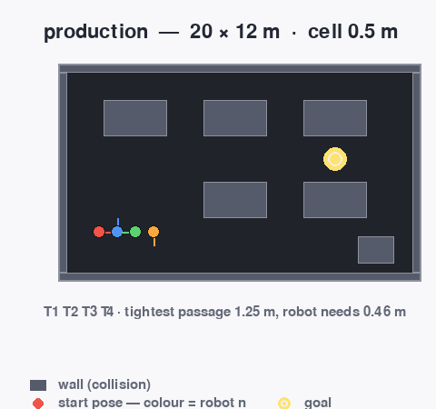
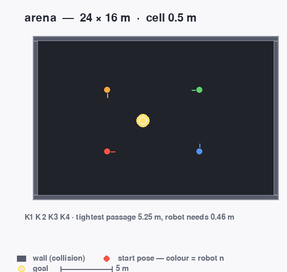
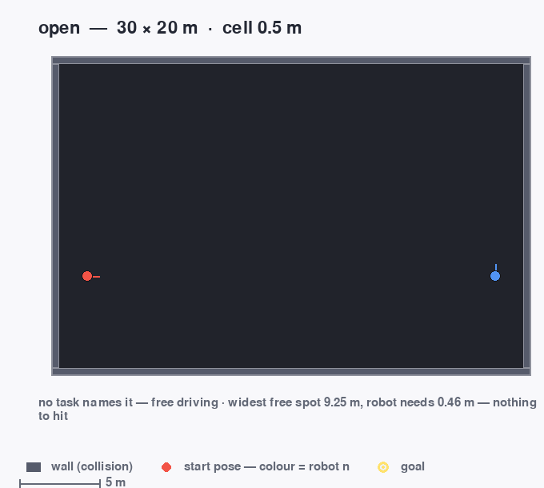
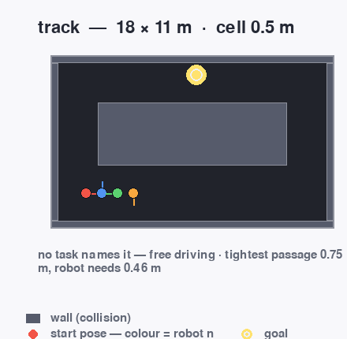
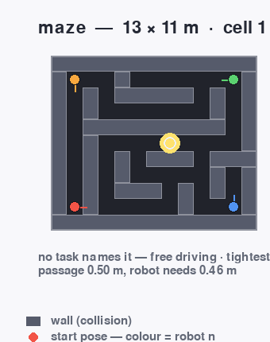

# Mecanum lab

A 2D simulator of one mecanum robot, for a lab course in two parts.

* **Experiment 1 — kinematics.** The student writes the inverse kinematics and drives the tasks.
* **Experiment 2 — state estimation.** The simulator drives; the student writes a Kalman filter that
  estimates the position from GPS, odometry and IMU.

Everything is started with ROS 2. Every run also works without ROS: pygame and the standard library,
no build, no numpy, no daemon.

## Install

```bash
./install.sh
```

Checks python, pygame, pytest and ROS, installs what is missing, builds the ROS package. Nothing goes
into your home directory, no sudo. `./install.sh --check` only looks, `./install.sh --mit-tests` adds a
short headless self test.

## Start

```bash
ros2 launch mecanum_lab lab.launch.py
```

Simulator, window, and rviz2 when rviz2 is installed. The keyboard drives the robot.

Until the package is built there is no package name to launch by, so the same file is started by path:
`ros2 launch launch/lab.launch.py`. Without ROS 2 the whole thing is one process:

```bash
./lab sim
```

Both doors read the same config files, so it is the same run. A launch file lists its own arguments:

```bash
ros2 launch mecanum_lab lab.launch.py --show-args
```

A node drives only when you ask for one, with `controller:=`. A node that publishes every tick
silences the keyboard, which is indistinguishable from a broken keyboard.

## The two experiments

Experiment 1, your node next to the simulator:

```bash
ros2 launch mecanum_lab lab.launch.py controller:=student/controller_template.py
```

Without ROS 2: `./lab run --robot alice --controller student/controller_template.py`.

Experiment 2, the simulation drives and your node reports an estimate on `/<robot>/kf/pose` — position
and its own σ, because the grade hangs on the uncertainty:

```bash
ros2 launch mecanum_lab kf.launch.py task:=kf_gps controller:=student/kf_template.py
```

Grading is one process for both experiments: grader, simulator and your node on one clock and one bus.
Every limit in `config/tasks.json` is calibrated on that form.

```bash
./lab grade --task alle --controller student/solution.py
```

```bash
./lab grade --task kf_alle --controller student/kf_template.py --log messung.csv
```

```bash
python3 tools/kfplot.py messung.csv
```

`grade:=alle` in a launch file measures something else: your node is a second process there, on a real
network. Measured on one seed, the reference solution is 100/100 through `./lab grade` and 70/100
through `grade:=alle` — see [When something does not work](#when-something-does-not-work) and
`docs/CONTRACT.md` §9.2.

What the tasks ask is not written on this page. The rules are data in `config/tasks.json`, `./lab docs`
prints them beside a running simulator, and the sheets a student reads are
`docs/praktikum/anleitung.tex` and `docs/praktikum/kalman.tex` (`make anleitung`, `make kalman`). Why
the robot stands still while the first task is graded, and what each line of the readout means:
**[docs/kinematics.md](docs/kinematics.md)**.

## The window

| input | what it does |
|---|---|
| `w`/`s` drive · `a`/`d` **strafe** | the two axes a mecanum base has; the keys set body speeds, this is not a game |
| `Up`/`Down` drive · `Left`/`Right` **strafe** | the same two axes as arrows |
| `q`/`e` (or `,`/`.`) turn left/right | ±0.9 rad/s. With teleop on, `q` turns instead of quitting; `esc` or the close button ends the run |
| `SHIFT` held while driving | both speeds doubled: 0.7 m/s and 1.8 rad/s instead of 0.35 and 0.9 |
| mouse wheel | zoom to the cursor · `+`/`-` zoom to the middle · `f` shows the whole world |
| drag with the left button | pan · the middle button centres again |
| right button | place a robot at the pointer, heading kept; one row per robot, `esc` closes the menu |
| `1`…`9` / `0` | follow one robot / show all of them |
| `SPACE` | pause |
| `m` | the layer menu, which starts closed so it covers nothing |
| `l t g k r v z h x o p i n c` | one layer per key: scan, trail, gps, estimate, wheels, velocity, goal, readout, shadow zones, odom ghost, source, dose map, radio, coverage map |
| the pointer | the world coordinate under it, inside the hall |

The window starts clean: the four raw measurement layers are off, so the map stays visible. The GPS
shadow zones are a model drawn over the floor — what the sky is worth where the robot stands — so they
are off until asked (`x`). On the bus nothing is hidden, `ros2 topic echo` still sees all of it.
`--view sensors` starts with everything on, `--layers scan,ghost,-hud` picks layers by hand. Layers, view
profiles and every segment of the readout line: **[docs/window.md](docs/window.md)**.

## The five halls


| Hall | Picture | What it is for | Started with |
|---|---|---|---|
| `production` |  | the drive tasks of Experiment 1 — tables stand in it, so a wrong wheel constant meets an obstacle instead of staying a number | `ros2 launch mecanum_lab lab.launch.py` |
| `arena` |  | the filter tasks of Experiment 2 — open floor, and a GPS that is switched off for part of the drive | `ros2 launch mecanum_lab kf.launch.py` |
| `open` |  | drift work: nothing between the robot and the wall, so a wrong wheel radius cannot hide behind a collision | `ros2 launch mecanum_lab lab.launch.py world:=open` |
| `track` |  | the lane the odometry demos drive their drift into | `ros2 launch mecanum_lab lab.launch.py world:=track` |
| `maze` |  | narrow passages, and the hall `config/default.json` falls back to when nothing names one | `ros2 launch mecanum_lab lab.launch.py world:=maze` |

Every task names the hall it is graded in inside `config/tasks.json`; `world:=` or `--world` overrides
it. Sizes, passage widths, the task-to-hall table and how to add `worlds/name.txt` of your own:
**[docs/worlds.md](docs/worlds.md)** and `python3 tools/worldcheck.py --world name`.

## How it works


A mecanum wheel pushes only across its roller axis. With all four rollers of one sign the sideways parts
cancel and the robot goes forward; with the front pair against the rear pair the forward parts cancel and
it strafes. Both halves of the figure are drawn by `tools/labmap.py` out of the modules the exercise is
graded with — the wheel mounts from `render.wheel_mounts()`, the roller axes from
`physics.inverse_kinematics()`, the topic names from `types.topic()` — and the tool refuses to draw when
a roller axis is not perpendicular to the velocity its own wheel produces.

Signs, units and topic contracts: `docs/CONTRACT.md` §5 and §6.

## The six demos

Each demo changes one block of the config and leaves the graded defaults alone, so starting one is a
command and not an edit.

| demo | what it turns on | page |
|---|---|---|
| `gps_shadow` | GPS that gets worse by place: shadow, bias, then no fix at all | [demos/gps_shadow.md](docs/demos/gps_shadow.md) |
| `odom_error` | odometry built on wheels that are half a centimetre too large | [demos/odom_error.md](docs/demos/odom_error.md) |
| `open_odrift` | the same wrong radius in an empty hall, GPS off | [demos/open_odrift.md](docs/demos/open_odrift.md) |
| `sensor_reality` | latency, dropout, staleness, a chip that warms up | [demos/sensor_reality.md](docs/demos/sensor_reality.md) |
| `wifi` | commands that travel by radio, and a radio with a range | [demos/wifi.md](docs/demos/wifi.md) |
| `poi_exploration` | a radiation source somewhere in the hall, one number to find it | [demos/poi_exploration.md](docs/demos/poi_exploration.md) |

`ros2 launch mecanum_lab demo.launch.py demo:=wifi` starts any of them through one launcher. Wheel slip
needs no config file: press the robot into a wall and the odometry keeps counting metres that were never
driven. `ros2 launch mecanum_lab lab.launch.py world:=arena`, then `Up` into the east wall. Measured in
`arena` over 4 s of full throttle: 0.69 m driven, 1.55 m counted. Speed knobs:
**[docs/demos.md](docs/demos.md)**.

## Where configuration lives

| Layer | File or option | Note |
|---|---|---|
| Defaults | `mecanum_lab/types.py` → `DEFAULT_CONFIG` | every sensor number of both experiments |
| Site | `config/default.json` | overrides the defaults |
| Task profile | `config/tasks.json` → `sim` | sensing per task: GPS rate, σ, outage, IMU |
| Command line | `--set gps.sigma_xy=1.2 --set imu.rate=400` | always wins |
| Launch file | `… launch.py --show-args` | every `--set` key is also a launch argument |

A launch argument counts only when it was typed. A launch file that passes its own default for a knob
nobody named outbids the `config:=` file, which is how a demo with `"world": "open"` in it once opened
`production`. Name it and it wins; leave it out and the config decides.

## The rest, by topic

| page | what is on it |
|---|---|
| [docs/demos.md](docs/demos.md) | the six demos and what makes a run go fast (`--speed`, `--fixed-step`) |
| [docs/kinematics.md](docs/kinematics.md) | Experiment 1: `serve()` and `mission()`, and the standing still |
| [docs/window.md](docs/window.md) | layers, view profiles, the readout line |
| [docs/worlds.md](docs/worlds.md) | the five arenas at one scale, task↔arena, the empty hall |
| [docs/steering.md](docs/steering.md) | the second drive train (Ackermann) and its two measured lessons |
| [docs/poi.md](docs/poi.md) | the radiation source `/poi`, its field, why it goes through tables |
| [docs/wifi.md](docs/wifi.md) | the radio link `/link`, and what `autonomy` means when it drops |
| [docs/CONTRACT.md](docs/CONTRACT.md) | the interface of Experiment 1: topics, units, signs, geometry |
| [docs/CONTRACT-KF.md](docs/CONTRACT-KF.md) | the interface of Experiment 2 |
| `docs/praktikum/` | the handouts: `make anleitung`, `make kalman` |

## More commands

What the tasks are, what is on the bus, what the examples do:

```bash
./lab docs
```

Grading with a report file written next to the grade:

```bash
./lab grade --task alle --controller student/solution.py --json bericht.json
```

The teaching team's gate — tests, grading, budgets, hygiene:

```bash
tools/check.sh
```

Alongside a running simulator: `ros2 topic echo /sim/robots --once` says who is driving, and
`ros2 service call /sim/spawn_next std_srvs/srv/Trigger` adds a further robot with the name the simulator
chose. Without ROS 2 those are `./lab spawn --name carlo` and `./lab rviz --robot alice`; to keep the
in-process bus even with ROS sourced, `MECANUM_ROS=stub ./lab sim`.

## When something does not work

* **`pygame is missing`** → `./install.sh`, or run everything with `--headless`.
* **No display, or SSH** → `--headless`, or `SDL_VIDEODRIVER=dummy`.
* **`ros2: command not found`** → source `/opt/ros/<distro>/setup.bash`. Everything except the `ros2 …`
  commands works without it.
* **The robot ignores the keyboard** → a node is publishing `cmd_vel` every tick. Start without
  `controller:=`, or with `--no-teleop` to watch the node on purpose.
* **RViz prints `Message Filter dropping message: frame 'muster/odom' …`** → one line, two meanings. Once,
  in the first 0.05 s, a spawned robot reaches `/tf` at the next `tf.rate` tick (20 Hz) while its `/odom`
  was already stamped 0.02 and 0.04. As a long stream it means the simulator is gone — ended or crashed —
  and RViz is the last process still waiting for transforms. The reason is then in the simulator, not in
  RViz.
* **A grade that does not repeat** → grade with `./lab grade`, not with `grade:=` in a launch file. The
  launch form puts your node in a second process on a real network, and the tasks that drive by odometry
  measure that: 100/100 against 70/100 on the same seed, because T3 gives up on its own estimate after
  4.6 m of the 12.9 m it needs. Every limit is calibrated on the one-process run (CONTRACT §9).
* **A grade in the wrong hall** → a run follows the hall named in the task, so `--task alle` in `maze`
  grades 40/100 with 31 wall contacts. `./lab grade --task alle --world maze` reproduces it.
* **`no measurement pairs`** → your node must publish `/<robot>/kf/pose`, and the simulator must publish
  truth (`--truth`, `truth:=true`; on by default in `kf.launch.py`).
* **The estimate lags behind the measurements** → you used the wall clock. What counts are the message
  stamps (`fix.t`, `odom.t`), never `time.time()`.
* **The second task starts far away** → discard the previous task's measurements (`fix.t >= mission
  start`). The handout section "Three rules" is about nothing else.

Two rules hold the tree together: stdlib and pygame only, and everything named and written in English.
Both are checked by `tools/check.sh`. Every run is deterministic from `--seed`.
